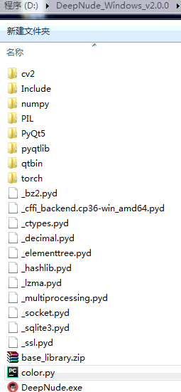
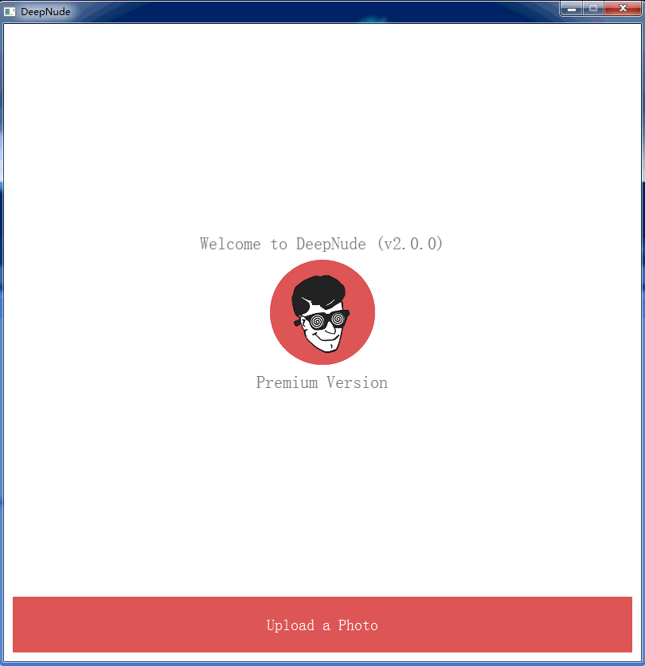
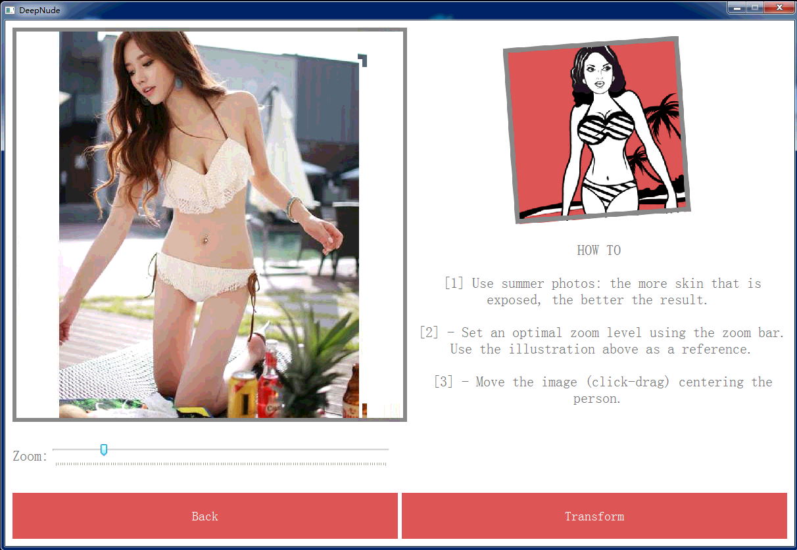
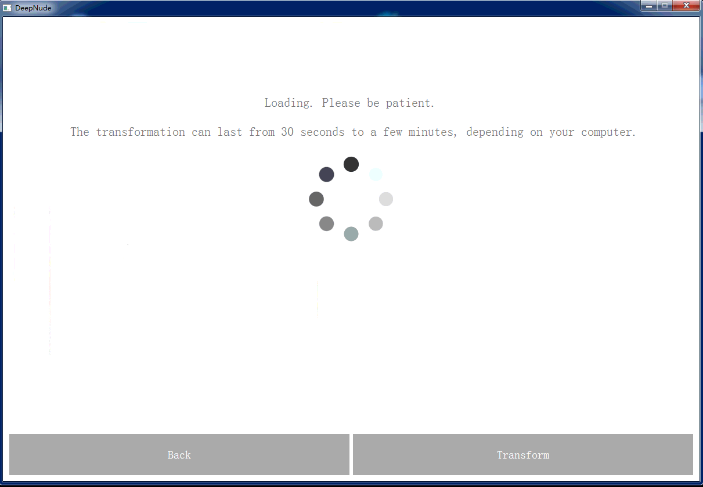
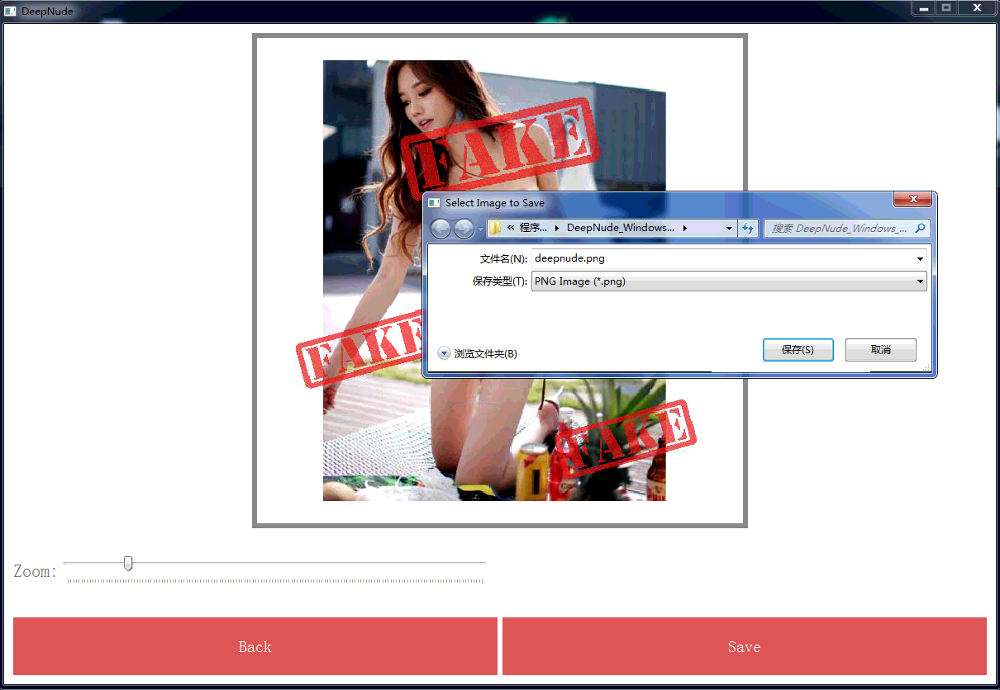

## DeepNude software itself


DeepNude uses an interesting method to solve a typical AI problem, so it could be useful for researchers and developers working in other fields such as fashion, cinema and visual effects.

This repo contains only the core algorithm and model weights, not the user interface( DeepNude_Windows_v2.0.0.zip or DeepNude.exe).


## Quick Start
> 中文用户请查看 https://github.com/zhengyima/DeepNude_NoWatermark_withModel

### Download code and model weights
|name|main download link(recommend)|alternative link|
|-|-|-|
|code| https://github.com/zhengyima/DeepNude_NoWatermark_withModel/archive/master.zip|https://github.com/stacklikemind/deepnude_official/archive/master.zip |
| weight(pyqtlib.rar)|  magnet:?xt=urn:btih:7BE4EB8D640742D2FFEBD6495E9392E9E2C399BC | https://pan.baidu.com/s/1zA1hZs8CRLJKgM5DT1ZjIg |

### Dependent Python library

Before launch the script install these packages in your Python3 environment:
- numpy
- Pillow
- setuptools
- six
- torch
- torchvision
- wheel
- opencv-python

### Run Model

To run the script you need the pythorch models: the large files (700MB) that are on the net (cm.lib, mm.lib, mn.lib, unzip pyqtlib.rar to get them). Put these file in a dir named: checkpoints.

**Launch the script**

```
 python3 main.py
```

The script will transform *input.png* to *output.png*.

If you download deepnude_official code.zip, the input.png should be 512pixel*512pixel.


### DeepNude's technology stack
> Look https://github.com/stacklikemind/deepnude_official for more.

After researching DeepNude technology, I have removed DeepNude.exe. Please don't ask me to get DeepNude program.



+ [Python](https://www.python.org/) + PyQt
+ [pytorch](https://pytorch.org/)
+ Deep Computer Vision

https://pan.baidu.com/s/1aaDbvLSNprF-2lVvYdLuag

### Windows version of DeepNude use process

> DeepNude can really achieve the purpose of Image-to-Image, and the generated image is more realistic.






Delete the color.cp36-win_amd64.pyd and libsqld.cp36-win_amd64.pyd files in the deepnude root directory, and then add the [color.py](color.py) and [libsqld.py](libsqld.py) file to get the advanced version of deepnude.


### What can be improved?

**DeepNude software shortcomings**

1. Size. Including 156M DeepNude_Windows_v2.0.0.zip and 1.90G pyqtlib.rar;
2. Speed. It takes 30 seconds to convert a picture;
3. Content. Use the Image-to-Image neural network to automatically remove the clothes from women to reveal their nudity. This application applies the wrong application of deep learning.

**Where DeepNude can be improved**

+ DeepNude can be implemented using [Tensorflow](https://www.tensorflow.org/) and uses model compression techniques.
+ DeepNude should change the current practice of not respecting women.
