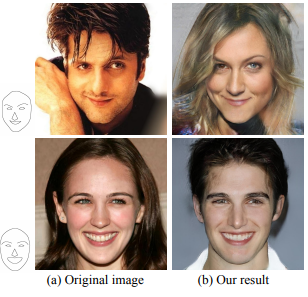
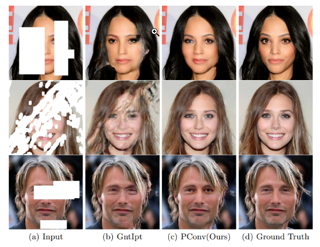
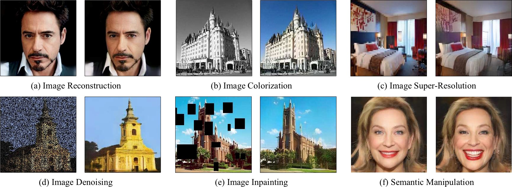

# DeepNude：一种由图像生成图像的技术
[English Version](https://github.com/yuanxiaosc/DeepNude-an-Image-to-Image-technology) | [中文版](README-ZH.md)

这个仓库包含[DeepNude](DeepNude_software_itself)的pix2pixHD(由英伟达提出)算法，更重要的是DeepNude背后通用的图像生成理论与实践研究。

本资源包含[pix2pix](Pix2Pix), [CycleGAN](CycleGAN), UGATIT, [DCGAN](DCGAN), SinGAN, [VAE](Variational_Autoencoder), ALAE, mGANprior和StarGAN-v2等图像生成模型的 [TensorFlow2](https://www.tensorflow.org/) (Pytorch | PaddlePaddle) 实现，可以用来系统性地学习生成对抗网络（GAN）。

---

## 本资源内容

1. 什么是 DeepNude?
2. 试玩图像生成Demo
3. 由正常图像生成色情图像
4. 由色情图像生成正常图像，色情图像检测
5. GAN 图像生成理论研究
6. GAN 图像生成实践研究
7. DeepNude 进阶 DeepFakes
8. 展望未来

---

> 此存储库由以下工具赞助，您对下面广告的每一次点击和免费试用都是对本项目的大力支持，谢谢！

---

## 什么是 DeepNude?

[DeepNude](https://github.com/yuanxiaosc/DeepNude-an-Image-to-Image-technology/tree/master/DeepNude_software_itself)使用了一个稍微修改过的 [pix2pixHD](https://github.com/NVIDIA/pix2pixHD) GAN 架构。pix2pixHD是由NVIDIA提出的一种通用的Image2Image技术。显然，DeepNude是人工智能技术的错误应用，但它使用的Image2Image技术对于在时尚，电影和视觉效果等其他领域工作的研究人员和开发人员非常有用。

---

## 假图像生成 Demo

这部分提供一个试玩的假图片生成Demo，你可以随心所欲的使用它们。它们是由StyleGAN生成的假图片，没有任何版权问题。每次刷新网页都会生成新的假图像，注意保存！

+ [Click to generate fake person image 点击生成假人图像](https://thispersondoesnotexist.com/)
+ [Click to generate fake cat image 点击生成假猫图像](http://thesecatsdonotexist.com/)
+ [Click to generate fake waifu image 点击生成假老婆图像](https://www.thiswaifudoesnotexist.net/)

## 由图像生成图像 Demo

这一部分提供一个试玩的 Image-to-Image Demo：黑白简笔画到色彩丰富的人脸、猫、鞋、手袋。DeepNude 软件主要使用了Image-to-Image技术，该技术理论上可以把你输入的图片转换成任何你想要的图片。你可以点击下方的Image-to-Image Demo在浏览器中体验Image-to-Image技术。

[尝试从草图深度生成人脸图像 Demo](http://www.geometrylearning.com:3000/index_621.html)

[尝试图片生成图像 Demo](https://affinelayer.com/pixsrv/)

一个使用范例如下（简笔画猫生成色彩丰富的猫的图像）：

在左侧框中按照自己想象画一个简笔画的猫，再点击process按钮，就能输出一个模型生成的猫。

---

## :underage: DeepNude Algorithm
> 如果你对DeepNude本身不感兴趣，可以直接跳过本节，查看后面章节中通用的Image-to-Image理论与实践研究。

[DeepNude_software_itself](DeepNude_software_itself) 内容:
1. 官方的DeepNude算法（基于Pytorch）
2. DeepNude软件的使用过程和优缺点评估。

### :+1: NSFW

使用CycleGAN神经网络模型实现 [porn, hentai, sexy, natural, drawings] 这些类别图像的转换，比如色情图像到安全/中性的图像转换。

1. [点击尝试色情图片检测](https://nsfwjs.com/)
2. [单击开始 NSFW 研究](NSFW)

---

## 图像生成理论研究

这一部分阐述DeepNude相关的人工智能/深度学习理论（特别是计算机视觉）研究，如果你喜欢阅读论文使用最新论文成果，尽情享用吧。

1. [单击此处以系统地了解GAN](GAN_History)
2. [单击此处以系统地了解将图像转换为图像的论文](https://github.com/lzhbrian/image-to-image-papers/blob/master/README.md)

### 1. Pix2Pix

+ 论文 Berkeley 2017 paper [Image-to-Image Translation with Conditional Adversarial Networks](https://arxiv.org/abs/1611.07004)
+ 主页 [Pix2Pix homepage](https://phillipi.github.io/pix2pix/)
+ 代码 code [pix2pix](https://github.com/phillipi/pix2pix)
+ Run in Google Colab [pix2pix.ipynb](https://github.com/tensorflow/docs/blob/master/site/en/r2/tutorials/generative/pix2pix.ipynb)

**效果**

[Image-to-Image Translation with Conditional Adversarial Networks](https://arxiv.org/abs/1611.07004) is a general solution for the use of conditional confrontation networks as an image-to-image conversion problem proposed by the University of Berkeley.

[Image-to-Image Translation with Conditional Adversarial Networks](https://arxiv.org/abs/1611.07004) 是伯克利大学研究提出的使用条件对抗网络作为图像到图像转换问题的通用解决方案。

查看更多论文研究（点击左侧黑色箭头展开）

### 2. Pix2PixHD
> DeepNude主要使用此图像到图像（Pix2PixHD）技术。

+ 论文 NVIDIA 2018 [High-Resolution Image Synthesis and Semantic Manipulation with Conditional GANs](https://arxiv.org/abs/1711.11585)
+ 主页 [Pix2PixHD homepage](https://tcwang0509.github.io/pix2pixHD/)
+ 代码 code [pix2pixHD](https://github.com/NVIDIA/pix2pixHD)

**效果**

从语义图上获得高分辨率图片。语义图是一幅彩色图片，图上的不同色块代表不同种类物体，如行人、汽车、交通标志、建筑物等。Pix2PixHD将一张语义图作为输入，并由此生成了一张高分辨率的逼真的图像。之前的技术多数只能生成粗糙的低分辨率的图片，看起来也不真实。而这个研究却生成了2k乘1k分辨率的图像，已经很接近全高清的照片。

### 3. CycleGAN

+ 论文 Berkeley 2017 paper [Unpaired Image-to-Image Translation using Cycle-Consistent Adversarial Networks](https://arxiv.org/abs/1703.10593)
+ 主页 [CycleGAN homepage](https://junyanz.github.io/CycleGAN/)
+ 代码 code [CycleGAN](https://github.com/junyanz/CycleGAN)
+ Run in Google Colab [cyclegan.ipynb](https://github.com/tensorflow/docs/blob/master/site/en/r2/tutorials/generative/cyclegan.ipynb)

**效果**

CycleGAN使用循环一致性损失函数来实现训练，而无需配对数据。换句话说，它可以从一个域转换到另一个域，而无需在源域和目标域之间进行一对一映射。这开启了执行许多有趣任务的可能性，例如照片增强，图像着色，样式传输等。您只需要源和目标数据集。

### 4. UGATIT

+ 论文 NCSOFT 2019 paper [Unsupervised Generative Attentional Networks with Adaptive Layer-Instance Normalization for Image-to-Image Translation](https://github.com/taki0112/UGATIT)
+ 代码 code [UGATIT-TensorFlow](https://github.com/taki0112/UGATIT)  | [UGATIT-Pytorch](https://github.com/znxlwm/UGATIT-pytorch)
+ [UGATIT 原理解析](https://zhuanlan.zhihu.com/p/76936166)
+ [UGATIT 实验复现](https://zhuanlan.zhihu.com/p/76979105)

**效果**

UGATIT是一种新的无监督图像到图像转换方法，它以端到端的方式结合了新的注意模块和新的可学习的归一化功能。UGATIT既可以做需要整体变化 (Holistic Changes) 的图片转换，也可以做需要大幅形状变化 (Large Shape Changes ) 的图片转换。它可以看做CycleGAN的加强版本，是一种效果更好的通用图片转换框架。

### 5. StyleGAN

+ 论文 NVIDIA 2018 paper [A Style-Based Generator Architecture for Generative Adversarial Networks](https://arxiv.org/abs/1812.04948)
+ 代码 code [stylegan](https://github.com/NVlabs/stylegan)

**效果**

StyleGAN 不仅可以生成假的图片source A 和 source B，还可以结合从不同的力度上结合source A的内容和 source B的样式，具体说明如下表。

|Style 等级（源自 Source B）|Source A|Source B|
|-|-|-|
|高等级（粗略）|所有颜色（眼睛，头发，光线）和细节面部特征来自Source A|继承Source B高级的面部特征，如姿势、一般的发型、脸部形状和眼镜|
|中等级|姿势、一般的面部形状和眼镜来自Source A|继承Source B中级的面部特征 ，如发型，张开/闭着的眼睛|
|高等级（细微）|主要面部内容来自Source A|继承Source B高级面部特征，如颜色方案和微观结构|

#### StyleGAN2
+ 论文 NVIDIA 2019 paper [Analyzing and Improving the Image Quality of StyleGAN](https://arxiv.org/abs/1912.04958)
+ 代码 code [stylegan2](https://github.com/NVlabs/stylegan2)
+ Run in Google Colab [stylegan2](https://colab.research.google.com/drive/1ShgW6wohEFQtqs_znMna3dzrcVoABKIH)

在不增加StyleGAN计算量的条件下，在解决了StyleGAN生成图像伪影的同时还能得到细节更好的高质量图像，StyleGAN2实现了无条件图像建模任务上新的 SOTA。

### 6. Image Inpainting 图像修复

+ 论文 NVIDIA 2018 paper [Image Inpainting for Irregular Holes Using Partial Convolutions](https://arxiv.org/abs/1804.07723) and [Partial Convolution based Padding](https://arxiv.org/abs/1811.11718).
+ 代码 Paper code [partialconv](https://github.com/NVIDIA/partialconv)。

**效果**

在 [Image_Inpainting(NVIDIA_2018).mp4](https://github.com/yuanxiaosc/DeepNude-an-Image-to-Image-technology/raw/master/paper_images/Image_Inpainting(NVIDIA_2018).mp4) 视频中左侧的操作界面，只需用工具将图像中不需要的内容简单涂抹掉，哪怕形状很不规则，NVIDIA的模型能够将图像“复原”，用非常逼真的画面填补被涂抹的空白。可谓是一键P图，而且“毫无ps痕迹”。该研究来自Nvidia的Guilin Liu等人的团队，他们发布了一种可以编辑图像或重建已损坏图像的深度学习方法，即使图像穿了个洞或丢失了像素。这是2018 state-of-the-art的方法。

### 7. SinGAN
ICCV2019 最佳论文 - Marr prize

+ 论文 Israel Institute of Technology 2019 paper [SinGAN: Learning a Generative Model from a Single Natural Image](https://arxiv.org/abs/1905.01164)
+ 主页 [SinGAN homepage](http://webee.technion.ac.il/people/tomermic/SinGAN/SinGAN.htm)
+ 代码 code [SinGAN-Pytorch](https://github.com/tamarott/SinGAN)
+ 视频展示 Video Show [SinGAN for single image animation](https://youtu.be/xk8bWLZk4DU)
+ [SinGAN 原理解析](https://www.jiqizhixin.com/articles/2019-10-29-2)

**效果**

在这篇论文中，研究者介绍了一种无监督的生成模型 SinGAN，它以一种无条件约束的方式从单张自然图像中学习知识。经过训练，研究者的模型能捕捉图像块（patch）的内部分布，从而生成高质量、多样化的样本，并承载与训练图像相同的视觉内容。

SinGAN 包含一个全卷积金字塔 GAN，金字塔的每一层负责学习不同比例的图像块分布。这样就能生成具有任意大小和横纵比的新样本，这种生成样本明显具有可变性，但同时又能保持真实图像的全局结构与精细纹理。与之前的单图像 GAN 相比，研究者的方法不仅能生成纹理图像，同时它还以一种无条件约束的方式生成。SinGAN 通过使用多尺度对抗训练方案，从多种尺度学习了图像块信息。这样一来，模型就可以生成新的真实图像样本，其中在创建新的目标属性和结构的同时还保留了原始的图像块分布信息。如上展示了不同尺度图像的生成效果。研究者在最后还表明，SinGAN 生成的图像经常被人类弄混，它们与真实图像没什么差别。

### 8. ALAE

+ 论文 2020 paper [Adversarial Latent Autoencoders](https://arxiv.org/abs/2004.04467)
+ 代码 code [ALAE](https://github.com/podgorskiy/ALAE)

**效果**

关于自编码器有两个疑问尚未得到解决：自编码器是否具备和 GAN 同等的生成能力？自编码器能否学习解耦表征？美国西弗吉尼亚大学的研究者提出一种新型自编码器 Adversarial Latent Autoencoder (ALAE)，试图解决以上问题。ALAE是一个通用架构，它能够利用近期GAN在训练方面的改进。研究者表示ALAE具备与GAN相当的生成能力，且能够学习解耦表征。

### 9. mGANprior

+ 论文 2020 paper [Image Processing Using Multi-Code GAN Prior](https://arxiv.org/abs/1912.07116)
+ 主页 [mGANprior homepage](https://genforce.github.io/mganprior/)
+ 代码 code [mganprior](https://github.com/genforce/mganprior)

**效果**

为了让训练好的GAN能用于处理图像，现有方法尝试以重新反向传播（寻找合适的Z）或者添加一个额外的编码器encoder将图像映射到潜在空间。但多数情况下两者的重建并不理想。在这项工作中提出一种新的逆映射（image->Z）方法，将训练好的GAN作为一个有效的先验去处理多种图像处理任务。

### 10. StarGAN v2

+ 论文 Clova Research 2020 paper [StarGAN v2: Diverse Image Synthesis for Multiple Domains](https://arxiv.org/abs/1912.01865)
+ 视频 [Video](https://youtu.be/0EVh5Ki4dIY)
+ 代码 code [stargan-v2](https://github.com/clovaai/stargan-v2)

**效果**

一个好的图像到图像转换模型应该学习不同视觉域之间的映射，同时满足以下特性：1）生成图像的多样性和2）跨多个域的可伸缩性。现有的方法解决了这两个问题中的任何一个，对所有域都具有有限的多样性或多个模型。我们提出了StarGAN v2，这是一个可以同时解决这两个问题并在基线上显示出显著改进的结果的单一框架。

### 11. DeepFaceDrawing

+ 论文 Institute of Computing Technology, Chinese Academy of Sciences 2020 paper [DeepFaceDrawing: Deep Generation of Face Images from Sketches](http://www.geometrylearning.com/paper/DeepFaceDrawing.pdf)
+ 主页 [DeepFaceDrawing homepage](http://www.geometrylearning.com/DeepFaceDrawing/)
+ 视频 [Video](http://www.geometrylearning.com/DeepFaceDrawing/video/DeepFaceDrawing-video.mp4)
+ 代码 code [DeepFaceDrawing-Jittor](https://github.com/IGLICT/DeepFaceDrawing-Jittor)

**Result**

基于该方法的智能人脸画板，不需要用户拥有专业的绘画技巧，就能够从粗糙甚至不完整的草图生成高质量的人脸图像，并且同时支持对面部细节的编辑与控制。该算法降低了人脸肖像绘制的门槛，同时也减轻专业画家的工作难度，简单实用。

---

## Image Generation Practice Research
> 这些模型基于TensorFlow2的最新实现。

这一部分阐述DeepNude相关的人工智能/深度学习（特别是计算机视觉）代码实践，如果你喜欢动手做实验，尽情享用它们。

### 1. Pix2Pix

使用Pix2Pix模型（Conditional Adversarial Networks）实现黑白简笔画到彩图、平面房屋到立体房屋和航拍图到地图等功能。

[点击开始实验 1](Pix2Pix)

### 2. Pix2PixHD

[Pix2PixHD 官方实现](https://github.com/NVIDIA/pix2pixHD)

### 3. CycleGAN

使用CycleGAN神经网络模型实现照片风格转换、照片效果增强、照片中风景季节变换、物体转换四大功能。

[点击开始实验 3](CycleGAN)

### 4. DCGAN

使用DCGAN来实现随机数到图片生成任务，比如人脸生成。

[点击开始实验 4](DCGAN)

### 5. Variational Autoencoder (VAE)

使用VAE来实现随机数到图片生成任务，比如人脸生成。

[点击开始实验 5](Variational_Autoencoder)

### 6. Neural style transfer

使用VGG19来实现图片风格迁移效果，比如照片变油画、漫画。

[点击开始实验 6](Neural_style_transfer)

..........................................................................

如果你是使用[PaddlePaddle](https://github.com/PaddlePaddle/Paddle)的用户，可以参考以上模型的Paddle版本 [图像生成模型库 PaddleGAN](https://github.com/PaddlePaddle/models/tree/develop/PaddleCV/PaddleGAN)。

---

## DeepFakes (DeepNude的升级版)
> DeepFakes可以看做是DeepNude的升级版，它包含使用深度学习模型生成一系列可以以假乱真的东西技术，例如假的图像、假的音频和假的视频。

### [MyVoiceYourFace](https://www.myvoiceyourface.com/)
> MyVoiceYourFace 可以帮助你创建 Deepfake 视频，从一个静止的图片为上传的视频换脸生成假视频。它可以保留音频并模仿原视频的表情瞬间。你需要做的只是上传视频和想要替换的人脸图片。 [相关论文 First Order Motion Model for Image Animation](https://aliaksandrsiarohin.github.io/first-order-model-website/)

说话者视频 + 任何人脸A = 合成的人脸A的说话视频

[点击这里在线尝试 MyVoiceYourFace！](https://www.myvoiceyourface.com/)

### 基于GANs的真实感语音驱动人脸动画

一张照片 + 一段音频 = 合成视频

我们提出了一种 temporal GAN，其能够仅使用人的静止图像和包含语音的音频剪辑来产生动画面部。 使用此模型生成的视频不仅可以产生与音频同步的唇部动作，还可以呈现特有的面部表情，例如眨眼，眉毛等，同时能够捕捉说话者的情绪并将其反映在面部表情中。

+ 论文 Samsung and Imperial College London 2019 paper [Realistic Speech-Driven Facial Animation with GANs](https://arxiv.org/abs/1906.06337)
+ 主页 [Facial Animation homepage](https://sites.google.com/view/facial-animation)
+ 代码 code [Speech-Driven Animation](https://github.com/DinoMan/speech-driven-animation)
+ [中文版论文浅析](https://www.infoq.cn/article/CM72xuNm35pNdrw7p_yT?utm_source=related_read&utm_medium=article) [English version paper analysis](https://www.theverge.com/2019/6/20/18692671/deepfake-technology-singing-talking-video-portrait-from-a-single-image-imperial-college-samsung)

**对DeepFakes感兴趣?**

[点击这里系统性了解DeepFakes](DeepFakes)

---

## 展望未来

[点击阅读](Future)
