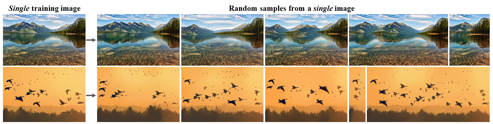

# DeepNude-an-Image-to-Image-technology
[中文版](README-ZH.md) | [English Version](https://github.com/yuanxiaosc/DeepNude-an-Image-to-Image-technology)

This repository contains the pix2pixHD algorithms(proposed by NVIDIA) of [DeepNude](DeepNude_software_itself), and more importantly, the general image generation theory and practice behind DeepNude.

This resource includes the TensorFlow2 (Pytorch | PaddlePaddle) implementation of image generation models such as [pix2pix](Pix2Pix), [CycleGAN](CycleGAN), UGATIT, [DCGAN](DCGAN), SinGAN, [VAE](Variational_Autoencoder), ALAE, mGANprior and StarGAN-v2, which can be used to systematically learn to Generating Adversarial Network (GAN).

---

## Content of this resource

1. What is DeepNude?
2. Fake Image Generation and Image-to-Image Demo
3. DeepNude Algorithm: Normal to Pornography Image
4. NSFW: Pornography to Normal Image, Pornographic Image Detection
5. GAN Image Generation Theoretical Research
6. GAN Image Generation Practice Research
7. DeepNude to DeepFakes
8. Future

---

> This repository is being sponsored by the following tool; please help to support us by taking a look and signing up to a free trial.

---

## What is DeepNude?
DeepNude uses a slightly modified version of the [pix2pixHD](https://github.com/NVIDIA/pix2pixHD) GAN architecture, quoted from deepnude_official. pix2pixHD is a general-purpose Image2Image technology proposed by NVIDIA. Obviously, DeepNude is the wrong application of artificial intelligence technology, but it uses Image2Image technology for researchers and developers working in other fields such as fashion, film and visual effects.

---

## Fake Image Generation Demo

This section provides a fake image generation demo that you can use as you wish. They are fake images generated by StyleGAN without any copyright issues. Note: Each time you refresh the page, a new fake image will be generated, pay attention to save!

+ [Click to generate fake person image](https://thispersondoesnotexist.com/)
+ [Click to generate fake cat image](http://thesecatsdonotexist.com/)
+ [Click to generate fake waifu image](https://www.thiswaifudoesnotexist.net/)

## Image-to-Image Demo

This section provides a demo of Image-to-Image Demo: Black and white stick figures to colorful faces, cats, shoes, handbags. DeepNude software mainly uses Image-to-Image technology, which theoretically converts the images you enter into any image you want. You can experience Image-to-Image technology in your browser by clicking Image-to-Image Demo below.

[Try Image-to-faces Demo](http://www.geometrylearning.com:3000/index_EN_621.html)

[Try Image-to-Image Demo](https://affinelayer.com/pixsrv/)

An example of using this demo is as follows：

In the left side box, draw a cat as you imagine, and then click the process button, you can output a model generated cat.

---

## :underage: DeepNude Algorithm
> DeepNude is a pornographic software that is forbidden by minors. If you are not interested in DeepNude itself, you can skip this section and see the general Image-to-Image theory and practice in the following chapters.

[DeepNude_software_itself](DeepNude_software_itself) content:
1. Official DeepNude Algorithm(Based on Pytorch)
2. DeepNude software usage process and evaluation of advantages and disadvantages.

### :+1: NSFW
> Recognition and conversion of five types of images [porn, hentai, sexy, natural, drawings]. Correct application of image-to-image technology.

NSFW(Not Safe/Suitable For Work) is a large-scale image dataset containing five categories of images [porn, hentai, sexy, natural, drawings]. Here, CycleGAN is used to convert different types of images, such as porn->natural.

1. [Click to try pornographic image detection Demo](https://nsfwjs.com/)
2. [Click Start NSFW Research](NSFW)

---

## Image Generation Theoretical Research

This section describes DeepNude-related AI/Deep Learning theory (especially computer vision) research. If you like to read the paper and use the latest papers, enjoy it.

1. [Click here to systematically understand GAN](GAN_History)
2. [Click here to systematically image-to-image-papers](https://github.com/lzhbrian/image-to-image-papers/blob/master/README.md)

### 1. Pix2Pix

+ Berkeley 2017 paper [Image-to-Image Translation with Conditional Adversarial Networks](https://arxiv.org/abs/1611.07004)
+ [Pix2Pix homepage](https://phillipi.github.io/pix2pix/)
+ code [pix2pix](https://github.com/phillipi/pix2pix)
+ Run in Google Colab [pix2pix.ipynb](https://github.com/tensorflow/docs/blob/master/site/en/r2/tutorials/generative/pix2pix.ipynb)

**Result**

[Image-to-Image Translation with Conditional Adversarial Networks](https://arxiv.org/abs/1611.07004) is a general solution for the use of conditional confrontation networks as an image-to-image conversion problem proposed by the University of Berkeley.

View more paper studies (Click the black arrow on the left to expand)

### 2. Pix2PixHD
> DeepNude mainly uses this Image-to-Image(Pix2PixHD) technology.

+ NVIDIA 2018 [High-Resolution Image Synthesis and Semantic Manipulation with Conditional GANs](https://arxiv.org/abs/1711.11585)
+ [Pix2PixHD homepage](https://tcwang0509.github.io/pix2pixHD/)
+ code [pix2pixHD](https://github.com/NVIDIA/pix2pixHD)

**Result**

Get high resolution images from the semantic map. The semantic graph is a color picture. The different color blocks on the map represent different kinds of objects, such as pedestrians, cars, traffic signs, buildings, and so on. Pix2PixHD takes a semantic map as input and produces a high-resolution, realistic image. Most of the previous techniques can only produce rough, low-resolution images that don't look real. This research has produced images with a resolution of 2k by 1k, which is very close to full HD photos.

### 3. CycleGAN

+ Berkeley 2017 paper [Unpaired Image-to-Image Translation using Cycle-Consistent Adversarial Networks](https://arxiv.org/abs/1703.10593)
+ [CycleGAN homepage](https://junyanz.github.io/CycleGAN/)
+ code [CycleGAN](https://github.com/junyanz/CycleGAN)
+ Run in Google Colab [cyclegan.ipynb](https://github.com/tensorflow/docs/blob/master/site/en/r2/tutorials/generative/cyclegan.ipynb)

**Result**

CycleGAN uses a cycle consistency loss to enable training without the need for paired data. In other words, it can translate from one domain to another without a one-to-one mapping between the source and target domain. This opens up the possibility to do a lot of interesting tasks like photo-enhancement, image colorization, style transfer, etc. All you need is the source and the target dataset.

### 4. UGATIT

+ NCSOFT 2019 paper [Unsupervised Generative Attentional Networks with Adaptive Layer-Instance Normalization for Image-to-Image Translation](https://github.com/taki0112/UGATIT)
+ code [UGATIT-TensorFlow](https://github.com/taki0112/UGATIT)  | [UGATIT-Pytorch](https://github.com/znxlwm/UGATIT-pytorch)
+ [UGATIT principle analysis](https://zhuanlan.zhihu.com/p/76936166)
+ [UGATIT experimental recurrence](https://zhuanlan.zhihu.com/p/76979105)

**Result**

UGATIT is a novel method for unsupervised image-to-image translation, which incorporates a new attention module and a new learnable normalization function in an end-to-end manner. UGATIT can do both image conversions that require Holistic Changes, and image conversions that require Large Shape Changes. It can be seen as an enhanced version of CycleGAN, a more efficient general image conversion framework.

### 5. StyleGAN

+ NVIDIA 2018 paper [A Style-Based Generator Architecture for Generative Adversarial Networks](https://arxiv.org/abs/1812.04948)
+ code [stylegan](https://github.com/NVlabs/stylegan)

**Result**

Source A + Source B (Style) = ?

StyleGAN can not only generate fake images source A and source B, but also combine the content of source A and source B from different strengths, as shown in the following table.

|Style level (from source b)|Source A|Source B|
|-|-|-|
|High level (coarse) | all colors (eyes, hair, light) and details facial features from Source A| inherit advanced facial features from Source B, such as posture, general hair style, facial shape and glasses|
|Medium level | posture, general facial shape and glasses come from source a| inherits the middle level facial features of source B, such as hair style, open / closed eyes|
|High level (fine) | the main facial content comes from source a| inherits the advanced facial features of source B, such as color scheme and microstructure|

#### StyleGAN2
Without increasing the amount of calculation of StyleGAN, while solving the image artifacts generated by StyleGAN and obtaining high-quality images with better details, StyleGAN2 implements a new SOTA for unconditional image modeling tasks.

+ NVIDIA 2019 paper [Analyzing and Improving the Image Quality of StyleGAN](https://arxiv.org/abs/1912.04958)
+ code [stylegan2](https://github.com/NVlabs/stylegan2)
+ Run in Google Colab [stylegan2](https://colab.research.google.com/drive/1ShgW6wohEFQtqs_znMna3dzrcVoABKIH)

### 6. Image Inpainting

+ NVIDIA 2018 paper [Image Inpainting for Irregular Holes Using Partial Convolutions](https://arxiv.org/abs/1804.07723) and [Partial Convolution based Padding](https://arxiv.org/abs/1811.11718).
+ Paper code [partialconv](https://github.com/NVIDIA/partialconv)。

**Result**

In the image interface of [Image_Inpainting(NVIDIA_2018).mp4](https://github.com/yuanxiaosc/DeepNude-an-Image-to-Image-technology/raw/master/paper_images/Image_Inpainting(NVIDIA_2018).mp4) video, you only need to use tools to simply smear the unwanted content in the image. Even if the shape is very irregular, NVIDIA's model can “restore” the image with very realistic The picture fills the smeared blank. It can be described as a one-click P picture, and "no ps traces." The study was based on a team from Nvidia's Guilin Liu et al. who published a deep learning method that could edit images or reconstruct corrupted images, even if the images were worn or lost pixels. This is the current 2018 state-of-the-art approach.

### 7. SinGAN
ICCV2019 Best paper - Marr prize

+ Israel Institute of Technology 2019 paper [SinGAN: Learning a Generative Model from a Single Natural Image](https://arxiv.org/abs/1905.01164)
+ [SinGAN homepage](http://webee.technion.ac.il/people/tomermic/SinGAN/SinGAN.htm)
+ code [SinGAN-Pytorch](https://github.com/tamarott/SinGAN)
+ Video Show [SinGAN for single image animation](https://youtu.be/xk8bWLZk4DU)
+ [SinGAN principle analysis](https://www.jiqizhixin.com/articles/2019-10-29-2)

**Result**

We introduce SinGAN, an unconditional generative model that can be learned from a single natural image. Our model is trained to capture the internal distribution of patches within the image, and is then able to generate high quality, diverse samples that carry the same visual content as the image. SinGAN contains a pyramid of fully convolutional GANs, each responsible for learning the patch distribution at a different scale of the image. This allows generating new samples of arbitrary size and aspect ratio, that have significant variability, yet maintain both the global structure and the fine textures of the training image. In contrast to previous single image GAN schemes, our approach is not limited to texture images, and is not conditional (i.e. it generates samples from noise). User studies confirm that the generated samples are commonly confused to be real images. We illustrate the utility of SinGAN in a wide range of image manipulation tasks.

### 8. ALAE

+ 2020 paper [Adversarial Latent Autoencoders](https://arxiv.org/abs/2004.04467)
+ code [ALAE](https://github.com/podgorskiy/ALAE)

**Result**

Although studied extensively, the issues of whether they have the same generative power of GANs, or learn disentangled representations, have not been fully addressed. We introduce an autoencoder that tackles these issues jointly, which we call Adversarial Latent Autoencoder (ALAE). It is a general architecture that can leverage recent improvements on GAN training procedures.

### 9. mGANprior

+ 2020 paper [Image Processing Using Multi-Code GAN Prior](https://arxiv.org/abs/1912.07116)
+ [mGANprior homepage](https://genforce.github.io/mganprior/)
+ code [mganprior](https://github.com/genforce/mganprior)

**Result**

Despite the success of Generative Adversarial Networks (GANs) in image synthesis, applying trained GAN models to real image processing remains challenging. Previous methods typically invert a target image back to the latent space either by back-propagation or by learning an additional encoder. However, the reconstructions from both of the methods are far from ideal. In this work, we propose a novel approach, called mGANprior, to incorporate the well-trained GANs as effective prior to a variety of image processing tasks.

### 10. StarGAN v2

+ Clova Research 2020 paper [StarGAN v2: Diverse Image Synthesis for Multiple Domains](https://arxiv.org/abs/1912.01865)
+ [Video](https://youtu.be/0EVh5Ki4dIY)
+ code [stargan-v2](https://github.com/clovaai/stargan-v2)

**Result**

A good image-to-image translation model should learn a mapping between different visual domains while satisfying the following properties: 1) diversity of generated images and 2) scalability over multiple domains. Existing methods address either of the issues, having limited diversity or multiple models for all domains. We propose StarGAN v2, a single framework that tackles both and shows significantly improved results over the baselines.

### 11. DeepFaceDrawing

+ Institute of Computing Technology, Chinese Academy of Sciences 2020 paper [DeepFaceDrawing: Deep Generation of Face Images from Sketches](http://www.geometrylearning.com/paper/DeepFaceDrawing.pdf)
+ [DeepFaceDrawing homepage](http://www.geometrylearning.com/DeepFaceDrawing/)
+ [Video](http://www.geometrylearning.com/DeepFaceDrawing/video/DeepFaceDrawing-video.mp4)
+ code [DeepFaceDrawing-Jittor](https://github.com/IGLICT/DeepFaceDrawing-Jittor)

**Result**

Recent deep image-to-image translation techniques allow fast generation of face images from freehand sketches. However, existing solutions tend to overfit to sketches, thus requiring professional sketches or even edge maps as input. To address this issue, our key idea is to implicitly model the shape space of plausible face images and synthesize a face image in this space to approximate an input sketch.

---

## Image Generation Practice Research
> These models are based on the latest implementation of TensorFlow2.

This section explains DeepNude-related AI/Deep Learning (especially computer vision) code practices, and if you like to experiment, enjoy them.

### 1. Pix2Pix

Use the Pix2Pix model (Conditional Adversarial Networks) to implement black and white stick figures to color graphics, flat houses to stereoscopic houses and aerial maps to maps.

[Click Start Experience 1](Pix2Pix)

### 2. Pix2PixHD

Under development... First you can use the [official implementation](https://github.com/NVIDIA/pix2pixHD)

### 3. CycleGAN

The CycleGAN neural network model is used to realize the four functions of photo style conversion, photo effect enhancement, landscape season change, and object conversion.

[Click Start Experience 3](CycleGAN)

### 4. DCGAN

DCGAN is used to achieve random number to image generation tasks, such as face generation.

[Click Start Experience 4](DCGAN)

### 5. Variational Autoencoder (VAE)
VAE is used to achieve random number to image generation tasks, such as face generation.

[Click Start Experience 5](Variational_Autoencoder)

### 6. Neural style transfer
Use VGG19 to achieve image style migration effects, such as photo changes to oil paintings and comics.

[Click Start Experience 6](Neural_style_transfer)

..........................................................................

If you are a user of [PaddlePaddle](https://github.com/PaddlePaddle/Paddle), you can refer to the [paddlepaddle version of the above model image generation model library paddegan](https://github.com/PaddlePaddle/models/tree/develop/PaddleCV/PaddleGAN).

---

## DeepFakes (Promotion of DeepNude)
> DeepFakes can be seen as an upgraded version of DeepNude, which uses a deep learning model to generate a series of techniques that can be faked, such as fake images, fake audio, and fake videos.

### [MyVoiceYourFace](https://www.myvoiceyourface.com/)
> Using deep fake machine learning to create a video from an image and a source video. [Related paper: First Order Motion Model for Image Animation](https://aliaksandrsiarohin.github.io/first-order-model-website/)

Speaker's Video + Any Image = Fake Video

[click to try MyVoiceYourFace Online!](https://www.myvoiceyourface.com/)

### Realistic Speech-Driven Facial Animation with GANs
One photo + One audio = Composite Video

We propose a temporal GAN capable of producing animated faces using only a still image of a person and an audio clip containing speech. The videos generated using this model do not only produce lip movements that are synchronized with the audio but also exhibit characteristic facial expressions such as blinks, brow raises etc. This extends our previous model by separately dealing with audio-visual synchronization and expression generation. Our improved model works on "in-the-wild" unseen faces and is capable of capturing the emotion of the speaker and reflecting it in the facial expression.

+ Samsung and Imperial College London 2019 paper [Realistic Speech-Driven Facial Animation with GANs](https://arxiv.org/abs/1906.06337)
+ [Facial Animation homepage](https://sites.google.com/view/facial-animation)
+ code [Speech-Driven Animation](https://github.com/DinoMan/speech-driven-animation)

**Interested in DeepFakes?**

[Click to start systematic learning DeepFakes](DeepFakes)

---

## Future

[Click read more...](Future)
